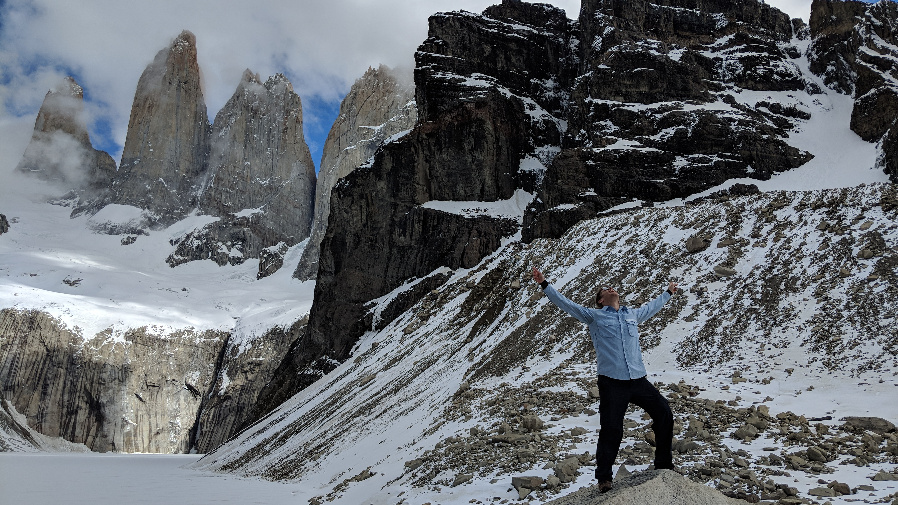
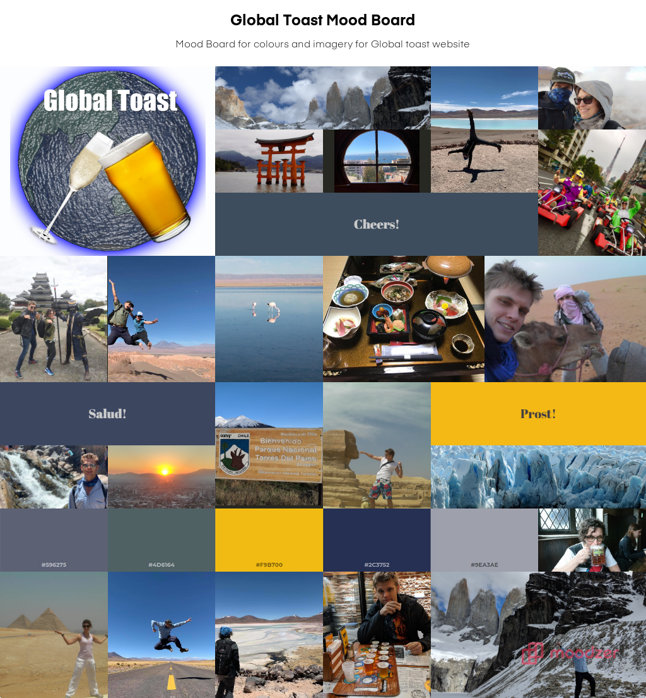
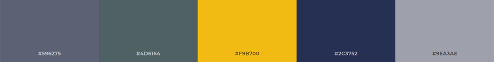

# Global Toast Moodboard 

## What is Global Toast?
Global toast is a blog that my wife and I make to document our travels for a bit of fun as in the example video below (click the image to watch).

## Moodboard

The below Moodboard was created as practice and shows a colour scheme and imagery for if we were to create a website to host a blog and videos.

## Colour Pallete
Below is the colour pallete inspired by the global toast logo.

